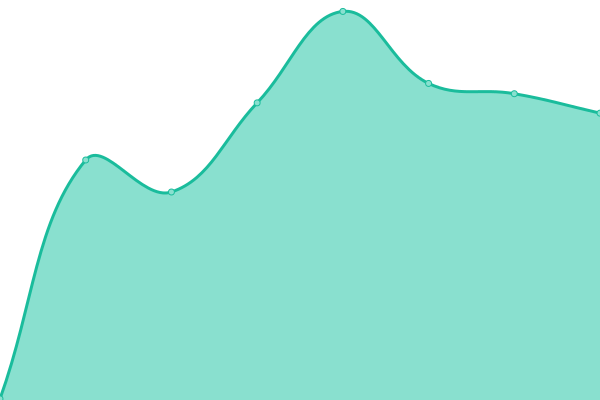

# [📈 Live Status](https://cxe-miex-dev.github.io/uptimes): <!--live status--> **🟥 Complete outage**

This repository contains the open-source uptime monitor and status page for [cxe-miex-dev](https://cxe-miex-dev.github.io/uptimes), powered by [Upptime](https://github.com/upptime/upptime).

With [Upptime](https://upptime.js.org), you can get your own unlimited and free uptime monitor and status page, powered entirely by a GitHub repository. We use [Issues](https://github.com/cxe-miex-dev/uptimes/issues) as incident reports, [Actions](https://github.com/cxe-miex-dev/uptimes/actions) as uptime monitors, and [Pages](https://cxe-miex-dev.github.io/uptimes) for the status page.

<!--start: status pages-->
<!-- This summary is generated by Upptime (https://github.com/upptime/upptime) -->
<!-- Do not edit this manually, your changes will be overwritten -->
<!-- prettier-ignore -->
| URL | Status | History | Response Time | Uptime |
| --- | ------ | ------- | ------------- | ------ |
|  [Paid - Panel](https://panelcxe.hexagonn.my.id/) | 🟥 Down | [paid-panel.yml](https://github.com/cxe-miex-dev/uptimes/commits/HEAD/history/paid-panel.yml) | 

 0ms
     
 | 

<a href="https://cxestatus.hexagonn.my.id/history/paid-panel">0.00%</a>
    

|  [Paid - Node SG 1](sgp1.hexagonn.my.id) | 🟥 Down | [paid-node-sg-1.yml](https://github.com/cxe-miex-dev/uptimes/commits/HEAD/history/paid-node-sg-1.yml) | 

 0ms
     
 | 

<a href="https://cxestatus.hexagonn.my.id/history/paid-node-sg-1">0.00%</a>
    

|  [Paid - Node SG 2](sgp2.hexagonn.my.id) | 🟥 Down | [paid-node-sg-2.yml](https://github.com/cxe-miex-dev/uptimes/commits/HEAD/history/paid-node-sg-2.yml) | 

 0ms
     
 | 

<a href="https://cxestatus.hexagonn.my.id/history/paid-node-sg-2">0.00%</a>
    

<!--end: status pages-->

[**Visit our status website →**](https://cxe-miex-dev.github.io/uptimes)

## 📄 License

- Powered by: [Upptime](https://github.com/upptime/upptime)
- Code: [MIT](./LICENSE) © [cxe-miex-dev](https://cxe-miex-dev.github.io/uptimes)
- Data in the `./history` directory: [Open Database License](https://opendatacommons.org/licenses/odbl/1-0/)
